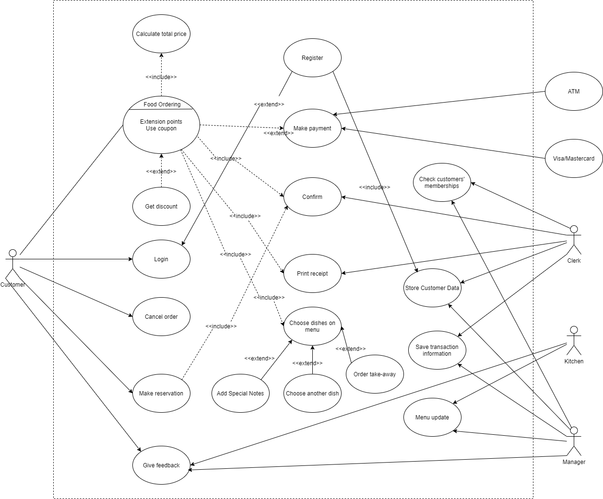

## HO CHI MINH CITY UNIVERSITY OF TECHNOLOGY HCMUT - BACH KHOA, VIETNAM NATIONAL UNIVERSITY - HO CHI MINH
## SOFTWARE ENGINEERING PROJECT - SEMESTER 211
## Restaurant POS System 2.0
[Final report here](/Document/Programming_Intergration_Project_Report.pdf)
### Table of contents:

* [About the team](#about-the-team)
* [Introduction](#introduction)
* [Use-case Diagrams](#use-case-diagram)
* [Built-with](#built-with)
* [Get Started](#get-started)
* [Reference](#reference)

## About the team

| Name        | MSSV           |
| ------------- |:-------------:|
| Phạm Văn Minh Toàn    | 1953028   |
| Hoàng Hà Giang        | 1952659   |
| Tiêu Viết Trọng Nghĩa | 1852611   |
| Nguyễn Khương         | 1952310   |
| Trần Quốc Duy         | 1952214   |
### Introduction:

CRM system is a system that stores information regarding customers who have made transactions with the restaurant. From there, it is possible to make a list of potential customers for the restaurant so that reasonable business strategies can be devised.

Therefore, within the scope of this project, we perform some basic functions that a CRM system should have, including: 
* Customer information management
* Order management
* Menu management
* Voucher management 

<p align="center">
    
    <br />
</p>

In addition, this CRM system will also decentralize administration based on employee roles in the restaurant including: Owner, Clerk, Chef - each role will be __limited with only a handful__ of features to ensure the security of restaurant data.

For further details, please take a look at our [final report](/Document/Programming_Intergration_Project_Report.pdf)

### Use-Case Diagram

The use-case diagram for the whole system:

<p align="center">
    
    <br />
    Use-case diagram for the whole system
</p>


### Built With

Here are some library that we worked on along the project.

* [CoreUI Dashboard](https://coreui.io/)
* [Laravel](https://laravel.com)
* [Bootstrap](https://getbootstrap.com)


### Get Started:

**Prequisite:**

* PHP and MySQL
```
apt-get install mysql-server
sudo apt install php7.4 php7.4-common php7.4-cli php7.4-xml php7.4-curl php7.4-json php7.4-gd php7.4-mbstring php7.4-intl 
php7.4-bcmath php7.4-bz2 php7.4-readline php7.4-zip php7.4-mysql
```

* Composer
``` 
curl -sS https://getcomposer.org/installer | php
mv composer.phar /usr/bin/composer
```

**Installation:**

1. Clone this repo

2. Move to the directory
```
cd CRM-System
```

3. Install dependency with composer
```
composer install
```
4. Create new .env file
```
cp .env.example .env
```

5. Modify .env file as follow:
```
DB_HOST=localhost<br>
DB_DATABASE=laravel<br>
```

6. Run MySQL service
```
service mysql start
```

7. Log in MySQL
```
mysql -u root -p
```

8. Create new database for laravel
```
CREATE DATABASE laravel;
exit;
```
9. Initialize database with Laravel Seeder
```
php artisan migrate --seed
```

10. Run local server
```
php artisan serve
```

### Reference:
This project is linked to another front-end website which send orders data to our CRM. Please take a look at this [repo](https://github.com/CapiZerbino/foodorder_project)
